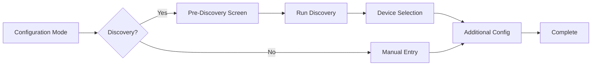

# Setup Flow Guide

The setup flow handles user interaction during device configuration. It provides a standard flow with extension points for customization.

## Overview

The setup flow follows this pattern:



## Basic Setup Flow

The simplest setup flow only requires implementing `get_manual_entry_form()` and `query_device()`:

```python
from ucapi_framework import BaseSetupFlow
from ucapi.api_definitions import RequestUserInput

class MySetupFlow(BaseSetupFlow[MyDeviceConfig]):
    """Minimal setup flow."""
    
    def get_manual_entry_form(self) -> RequestUserInput:
        """Define the manual entry form."""
        return RequestUserInput(
            title="Add Device",
            settings=[
                {
                    "id": "address",
                    "label": {"en": "Device IP Address"},
                    "field": {"text": {"value": ""}},
                },
                {
                    "id": "name",
                    "label": {"en": "Device Name"},
                    "field": {"text": {"value": ""}},
                },
            ],
        )
    
    async def query_device(
        self, device_id: str | None, input_values: dict
    ) -> MyDeviceConfig:
        """Create config from user input."""
        return MyDeviceConfig(
            identifier=device_id or input_values["address"].replace(".", "_"),
            name=input_values["name"],
            host=input_values["address"],
        )
```

## Extension Points

### Pre-Discovery Screens

Collect information before running discovery (API keys, server addresses, etc.):

```python
async def get_pre_discovery_screen(self) -> RequestUserInput | None:
    """Screen shown before discovery."""
    return RequestUserInput(
        title="Authentication",
        settings=[
            {
                "id": "api_key",
                "label": {"en": "API Key"},
                "field": {"text": {"value": ""}},
            },
        ],
    )

async def handle_pre_discovery_response(
    self, msg: UserDataResponse
) -> SetupAction:
    """Process pre-discovery input."""
    # Store API key for use in discovery
    self._pending_config["api_key"] = msg.input_values["api_key"]
    
    # Continue to discovery
    return await self._handle_discovery()
```

### Additional Configuration

Collect device-specific settings after device selection:

```python
async def get_additional_configuration_screen(
    self, device_config: MyDeviceConfig
) -> RequestUserInput | None:
    """Screen shown after device selection."""
    return RequestUserInput(
        title="Device Settings",
        settings=[
            {
                "id": "zone",
                "label": {"en": "Zone"},
                "field": {
                    "dropdown": {
                        "value": "main",
                        "items": [
                            {"id": "main", "label": {"en": "Main"}},
                            {"id": "zone2", "label": {"en": "Zone 2"}},
                        ],
                    }
                },
            },
        ],
    )

async def handle_additional_configuration_response(
    self, msg: UserDataResponse, device_config: MyDeviceConfig
) -> SetupAction:
    """Process additional configuration."""
    # Update config with zone selection
    self._pending_device_config = msg.input_values["zone"]
    
    # Continue with finalization, data in _pending_device_config will automatically be saved
    # There are several more options to complete setup. Refer to method docs for details
    return None
```

### Custom Discovery Fields

Add extra fields to the discovery result screen:

```python
def get_additional_discovery_fields(self) -> list[dict]:
    """Add custom fields to discovery screen."""
    return [
        {
            "id": "zone",
            "label": {"en": "Zone"},
            "field": {
                "dropdown": {
                    "value": "main",
                    "items": [
                        {"id": "main", "label": {"en": "Main Zone"}},
                        {"id": "zone2", "label": {"en": "Zone 2"}},
                    ],
                }
            },
        }
    ]

def extract_additional_setup_data(
    self, input_values: dict, device_config: MyDeviceConfig
) -> None:
    """Extract custom field values."""
    if "zone" in input_values:
        device_config.zone = input_values["zone"]
```

## Configuration Modes

The setup flow handles three configuration modes automatically:

- **ADD** - Add a new device
- **REMOVE** - Remove an existing device
- **RESET** - Clear all devices and configuration

## Backup & Restore

Backup and restore are automatically handled by the framework. Users can:

- **Export** configuration as JSON
- **Import** configuration from JSON

## Complete Example

See the [API Reference](../api/setup.md) for complete documentation of all methods and extension points.
