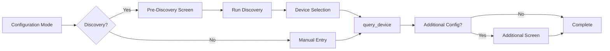

# Setup Flow Guide

The setup flow handles user interaction during device configuration. It provides a standard flow with extension points for customization.

## Overview

The setup flow follows this pattern:



## Key Concept: Unified Flow

Both discovery and manual entry paths converge on `query_device()`. This means you only implement device validation logic once:

- **Manual entry** → `query_device(input_values)`
- **Discovery selection** → `prepare_input_from_discovery()` → `query_device(input_values)`

## Basic Setup Flow

The simplest setup flow requires implementing `get_manual_entry_form()` and `query_device()`:

```python
from ucapi_framework import BaseSetupFlow
from ucapi.api_definitions import RequestUserInput

class MySetupFlow(BaseSetupFlow[MyDeviceConfig]):
    """Minimal setup flow."""
    
    def get_manual_entry_form(self) -> RequestUserInput:
        """Define the manual entry form."""
        return RequestUserInput(
            title="Add Device",
            settings=[
                {
                    "id": "address",
                    "label": {"en": "Device IP Address"},
                    "field": {"text": {"value": ""}},
                },
                {
                    "id": "name",
                    "label": {"en": "Device Name"},
                    "field": {"text": {"value": ""}},
                },
            ],
        )
    
    async def query_device(self, input_values: dict) -> MyDeviceConfig:
        """Create config from user input (works for both manual and discovery)."""
        return MyDeviceConfig(
            identifier=input_values.get("identifier", input_values["address"].replace(".", "_")),
            name=input_values["name"],
            host=input_values["address"],
        )
```

## Extension Points

### Pre-Discovery Screens

Collect information before running discovery (API keys, server addresses, etc.):

```python
async def get_pre_discovery_screen(self) -> RequestUserInput | None:
    """Screen shown before discovery."""
    return RequestUserInput(
        title="Authentication",
        settings=[
            {
                "id": "api_key",
                "label": {"en": "API Key"},
                "field": {"text": {"value": ""}},
            },
        ],
    )

async def handle_pre_discovery_response(
    self, msg: UserDataResponse
) -> SetupAction:
    """Process pre-discovery input."""
    # Data is automatically stored in self._pre_discovery_data
    # and merged with manual entry input later
    
    # Continue to discovery
    return await self._handle_discovery()
```

### Discovery to Input Conversion

When a user selects a discovered device, override `prepare_input_from_discovery()` to convert the discovered device data to the same format as manual entry:

```python
async def prepare_input_from_discovery(
    self, discovered: DiscoveredDevice, additional_input: dict
) -> dict:
    """Convert discovered device to input_values format."""
    return {
        "identifier": discovered.identifier,
        "address": discovered.address,
        "name": additional_input.get("name", discovered.name),
        "port": discovered.extra_data.get("port", 8080),
    }
```

The default implementation returns basic fields (`identifier`, `address`, `name`) plus any additional input fields.

### Additional Configuration

Collect device-specific settings after device selection:

```python
async def get_additional_configuration_screen(
    self, device_config: MyDeviceConfig, input_values: dict
) -> RequestUserInput | None:
    """Screen shown after query_device succeeds."""
    return RequestUserInput(
        title="Device Settings",
        settings=[
            {
                "id": "zone",
                "label": {"en": "Zone"},
                "field": {
                    "dropdown": {
                        "value": "main",
                        "items": [
                            {"id": "main", "label": {"en": "Main"}},
                            {"id": "zone2", "label": {"en": "Zone 2"}},
                        ],
                    }
                },
            },
        ],
    )

async def handle_additional_configuration_response(
    self, msg: UserDataResponse
) -> SetupAction:
    """Process additional configuration."""
    # Fields are auto-populated to self._pending_device_config
    # Just return None to save and complete
    return None
```

### Custom Discovery Fields

Add extra fields to the discovery result screen:

```python
def get_additional_discovery_fields(self) -> list[dict]:
    """Add custom fields to discovery screen."""
    return [
        {
            "id": "zone",
            "label": {"en": "Zone"},
            "field": {
                "dropdown": {
                    "value": "main",
                    "items": [
                        {"id": "main", "label": {"en": "Main Zone"}},
                        {"id": "zone2", "label": {"en": "Zone 2"}},
                    ],
                }
            },
        }
    ]
```

These additional input values are passed to `prepare_input_from_discovery()`.

## Multi-Screen Flows

For complex setups requiring multiple screens:

```python
async def query_device(self, input_values: dict) -> MyDeviceConfig | RequestUserInput:
    """Query device and optionally show more screens."""
    # Test connection
    device_info = await self._api.get_device_info(input_values["address"])
    
    if not device_info:
        return SetupError(error_type=IntegrationSetupError.CONNECTION_REFUSED)
    
    # Store config for multi-screen flow
    self._pending_device_config = MyDeviceConfig(
        identifier=device_info["id"],
        name=input_values["name"],
        address=input_values["address"],
    )
    
    # Show additional screen
    return RequestUserInput(
        {"en": "Select Options"},
        [{"id": "option", "label": {"en": "Option"}, 
          "field": {"text": {"value": ""}}}]
    )
```

## Configuration Modes

The setup flow handles three configuration modes automatically:

- **ADD** - Add a new device
- **REMOVE** - Remove an existing device
- **RESET** - Clear all devices and configuration

## Backup & Restore

Backup and restore are automatically handled by the framework. Users can:

- **Export** configuration as JSON
- **Import** configuration from JSON

## Complete Example

See the [API Reference](../api/setup.md) for complete documentation of all methods and extension points.
